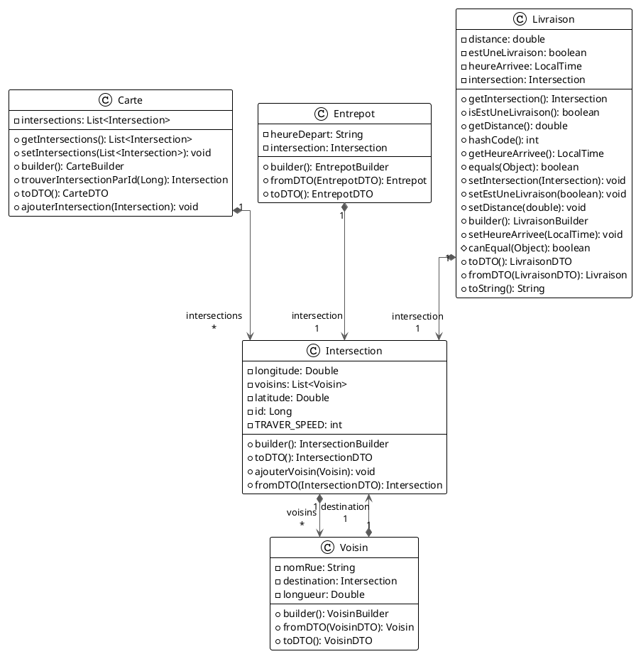

```plantuml
@startuml

!theme plain
top to bottom direction
skinparam linetype ortho

class Carte {
  - intersections: List<Intersection>
  + getIntersections(): List<Intersection>
  + setIntersections(List<Intersection>): void
  + builder(): CarteBuilder
  + trouverIntersectionParId(Long): Intersection
  + toDTO(): CarteDTO
  + ajouterIntersection(Intersection): void
}
class Entrepot {
  - heureDepart: String
  - intersection: Intersection
  + builder(): EntrepotBuilder
  + fromDTO(EntrepotDTO): Entrepot
  + toDTO(): EntrepotDTO

}
class Intersection {
  - longitude: Double
  - voisins: List<Voisin>
  - latitude: Double
  - id: Long
  - TRAVER_SPEED: int
  + builder(): IntersectionBuilder
  + toDTO(): IntersectionDTO
  + ajouterVoisin(Voisin): void
  + fromDTO(IntersectionDTO): Intersection
}
class Livraison {
  - distance: double
  - estUneLivraison: boolean
  - heureArrivee: LocalTime
  - intersection: Intersection
  + getIntersection(): Intersection
  + isEstUneLivraison(): boolean
  + getDistance(): double
  + hashCode(): int
  + getHeureArrivee(): LocalTime
  + equals(Object): boolean
  + setIntersection(Intersection): void
  + setEstUneLivraison(boolean): void
  + setDistance(double): void
  + builder(): LivraisonBuilder
  + setHeureArrivee(LocalTime): void
  # canEqual(Object): boolean
  + toDTO(): LivraisonDTO
  + fromDTO(LivraisonDTO): Livraison
  + toString(): String
}
class Voisin {
  - nomRue: String
  - destination: Intersection
  - longueur: Double
  + builder(): VoisinBuilder
  + fromDTO(VoisinDTO): Voisin
  + toDTO(): VoisinDTO
}

Carte        "1" *-[#595959,plain]-> "intersections\n*" Intersection 
Entrepot     "1" *-[#595959,plain]-> "intersection\n1" Intersection 
Intersection "1" *-[#595959,plain]-> "voisins\n*" Voisin       
Livraison    "1" *-[#595959,plain]-> "intersection\n1" Intersection 
Voisin       "1" *-[#595959,plain]-> "destination\n1" Intersection 
@enduml

```