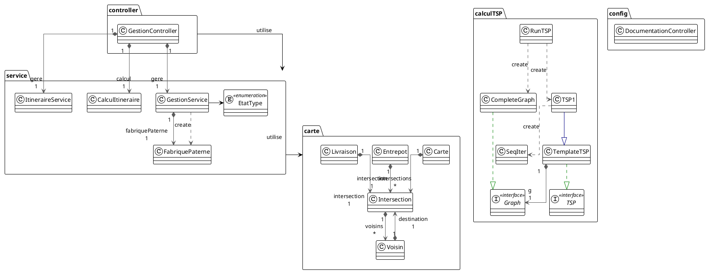

```plantuml
@startuml
!theme plain
top to bottom direction
skinparam linetype ortho
package carte{
class Carte{}
class Entrepot{}
class Intersection{}
class Livraison{}
class Voisin{}
}
package calculTSP{
class CompleteGraph {
}
class RunTSP {
}
class SeqIter {
}
interface TSP << interface >> {
}
class TSP1 {
}
class TemplateTSP {
}
interface Graph << interface >> {
}
}
package service {
class CalculItineraire {
}
enum EtatType << enumeration >> {
}
class FabriquePaterne {
}
class GestionService {
}
class ItineraireService {
}
}
package config{
class DocumentationController {
}
}
package controller{

class GestionController {
}
}


CompleteGraph            -[#008200,dashed]-^  Graph                   
GestionController       "1" *-[#595959,plain]-> "gere\n1" GestionService          
GestionController       "1" *-[#595959,plain]-> "calcul\n1" CalculItineraire
GestionController       "1" *-[#595959,plain]-> "gere\n1" ItineraireService
GestionService          "1" *-[#595959,plain]-> "fabriquePaterne\n1" FabriquePaterne         
GestionService           -[#595959,dashed]->  FabriquePaterne         : "«create»"
RunTSP                   -[#595959,dashed]->  CompleteGraph           : "«create»"
RunTSP                   -[#595959,dashed]->  TSP1                    : "«create»"
TSP1                     -[#595959,dashed]->  SeqIter                 : "«create»"
TSP1                     -[#000082,plain]-^  TemplateTSP             
TemplateTSP             "1" *-[#595959,plain]-> "g\n1" Graph                   
TemplateTSP              -[#008200,dashed]-^  TSP
GestionService -> EtatType


Carte        "1" *-[#595959,plain]-> "intersections\n*" Intersection 
Entrepot     "1" *-[#595959,plain]-> "intersection\n1" Intersection 
Intersection "1" *-[#595959,plain]-> "voisins\n*" Voisin       
Livraison    "1" *-[#595959,plain]-> "intersection\n1" Intersection 
Voisin       "1" *-[#595959,plain]-> "destination\n1" Intersection 

service --> carte : "«utilise»"
controller --> service : "«utilise»"
@enduml

```
```plantuml

```